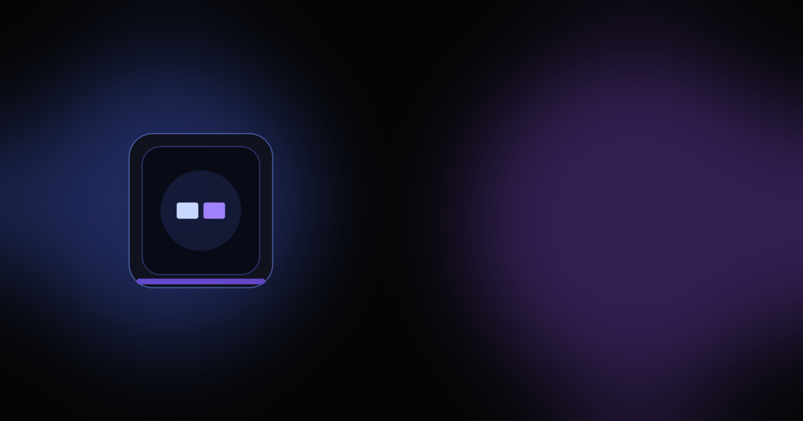

# DeskMate X1 — Smart Rechargeable Productivity Dashboard

A premium, futuristic product landing page for **DeskMate X1**, a smart rechargeable desk gadget built on the **ESP32-S3**. The site is designed in the spirit of brands like Nothing, Teenage Engineering, Linear and Raycast — dark, cinematic, glassmorphic and motion-rich.



## Overview

DeskMate X1 is a concept smart-desk companion that puts time, weather, room climate, ambient RGB and a Pomodoro productivity timer into one elegant always-on display. This repository is the marketing/landing site for that product.

Sections included:

- **Hero** — cinematic headline, animated gradients, a live 3D object, a live product mockup card and floating status pills
- **Features** — eight animated, glowing feature cards with mini UI previews
- **Product Showcase** — a large, live round dashboard with an RGB halo and floating metric chips
- **Use Cases** — Developers, Students and Desk Setup Enthusiasts
- **Tech Specs** — ESP32-S3, WiFi + BLE, touch display, BME280, BH1750, WS2812, LiPo, USB-C
- **Pricing** — Early Access and Creator Edition launch cards
- **Waitlist** — glassmorphism email capture form with frontend validation
- **Footer** — link columns and socials

Bonus touches: loading screen, custom cursor glow, scroll progress bar, animated starfield, live clock + weather widget, fake battery-charging animation and an online-sync pulse. A floating WhatsApp button is included throughout.

## Tech Stack

- [Vite](https://vitejs.dev/) — build tooling
- [React 18](https://react.dev/) (JSX, no TypeScript)
- [Tailwind CSS](https://tailwindcss.com/) — styling, with custom colors / glows / animations
- [Framer Motion](https://www.framer.com/motion/) — animations and transitions
- [React Three Fiber](https://r3f.docs.pmnd.rs/) + [drei](https://github.com/pmndrs/drei) + [Three.js](https://threejs.org/) — the 3D hero object
- [Lucide React](https://lucide.dev/) — icons

## Getting Started

Requires **Node.js 18+**.

```bash
# 1. Install dependencies
npm install

# 2. Start the dev server (opens http://localhost:5173)
npm run dev

# 3. Build for production
npm run build

# 4. Preview the production build locally
npm run preview
```

## Project Structure

```
DESKMATE_X1/
├── public/                 # favicon + OG preview image
├── src/
│   ├── assets/             # generated placeholder art (hero, dashboard, grid, glow)
│   ├── components/         # Navbar, Hero, Features, ProductShowcase, UseCases,
│   │                       # TechSpecs, Pricing, Waitlist, Footer,
│   │                       # AmbientBackground, FloatingOrb, Loader
│   ├── pages/Home.jsx      # page assembly + floating WhatsApp button
│   ├── styles/globals.css  # Tailwind layers + custom utilities
│   ├── App.jsx             # loader + cursor glow orchestration
│   ├── main.jsx            # React entry point
│   └── data.js             # all section content in one place
├── index.html
├── tailwind.config.js
├── postcss.config.js
├── vite.config.js
└── package.json
```

## Customization

- **Content** lives in `src/data.js` — features, specs, pricing, nav links and the WhatsApp number all in one file.
- **Theme** (colors, glows, fonts, keyframe animations) lives in `tailwind.config.js`.
- **WhatsApp link** is the `WHATSAPP_LINK` constant in `src/data.js` (placeholder: `https://wa.me/919999999999`). Replace with your real number.
- **Assets** in `src/assets` are generated placeholders — swap them for real product renders anytime.

## Notes

The waitlist form is frontend-only and performs validation in the browser; no data is sent anywhere. Wire it to your backend or a service like Formspree / Resend when you go live.

---

Built as a concept. Not affiliated with any real company.
